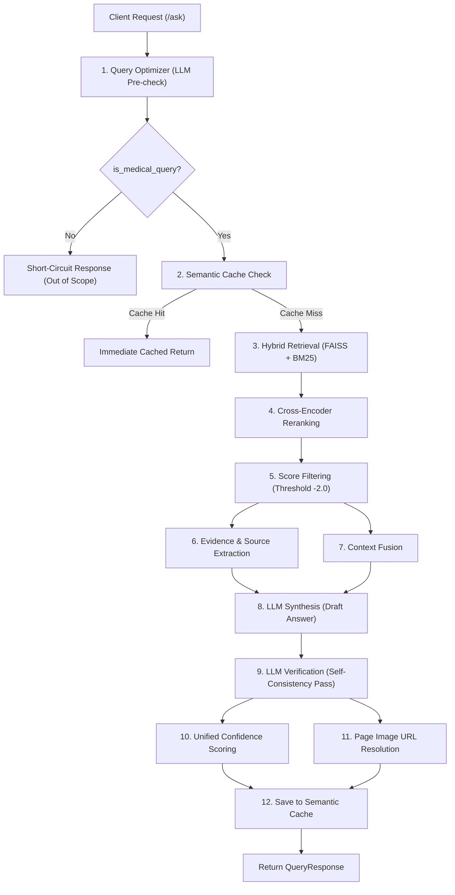

# HarrisonGPT Backend Pipeline Control Flow & Workflow

This document details the complete end-to-end control flow of HarrisonGPT when a client issues a request to the `/ask` endpoint.

---

## 🗺️ High-Level Pipeline Architecture

The pipeline consists of a pre-retrieval validation & expansion step, a multi-query hybrid retrieval & reranking step, an LLM generation & verification cycle, and post-generation confidence scoring & rendering.

---

## 🤖 LLM Models, Embeddings & Token Metrics

Below is a detailed breakdown of the models, embedding engines, token limits, and hyperparameters utilized throughout the pipeline:

### 1. Models Directory
| Pipeline Stage | Model Role | Model Name | Provider / Engine |
| :--- | :--- | :--- | :--- |
| **Pre-Retrieval Gatekeeper** | Query expansion, medical classification | `llama-3.1-8b-instant` | Groq |
| **Response Generation** | Core medical answer synthesis | `llama-3.3-70b-versatile` | Groq |
| **Verification Pass** | Post-generation factual self-consistency | `llama-3.3-70b-versatile` | Groq |
| **Semantic Embedding** | Caching and dense retrieval indexing | `all-MiniLM-L6-v2` | SentenceTransformers (Local) |
| **Reranker** | Cross-encoder semantic-relevance scoring | `ms-marco-MiniLM-L-6-v2` | SentenceTransformers (Local) |

### 2. Runtime Hyperparameters & Token Limits

#### A. Query Optimizer Agent
* **Model Name:** `llama-3.1-8b-instant` (Optimized for low latency)
* **Temperature:** `0.0` (Configured for strict deterministic output)
* **Max Target Tokens:** `256` tokens
* **Output Specification:** Strictly returns a JSON structure with keys: `is_medical_query` (bool), `expanded_query` (str), `focus` (str), and `complexity` (simple/complex).

#### B. Response Generation (Main Synthesis)
* **Model Name:** `llama-3.3-70b-versatile`
* **Temperatures:** 
  * `0.1` (for `smart_summary` mode - minimizes creativity to favor factual precision)
  * `0.2` (for `qa` mode)
* **Max Target Tokens:**
  * `smart_summary` mode: `2200` tokens
  * `qa` mode: `900` tokens
* **Context Budget:** Up to `18,000` characters (~4,500 tokens) of fused textbook context is injected from the RAG pipeline.

#### C. Self-Consistency Verification Pass
* **Model Name:** `llama-3.3-70b-versatile`
* **Temperature:** `0.0` (Rigid compliance)
* **Max Target Tokens:** Matches the generation limits (`2200` for summaries, `900` for QA).
* **Factual Check Constraint:** Compares draft output against raw retrieval context. Sentences containing claims not found in the context are rewritten or omitted.

---

## 📂 Component Map & File Control Flow

Below is the directory/file trace mapped to the order of execution:

| Step | Phase | Module File Path | Main Function/Class | Purpose |
| :--- | :--- | :--- | :--- | :--- |
| **0** | Entry Point | [main.py](file:///Users/shivasairahulkuntala/Developer/AI_Projects/nlp_models/Harrison/backend/api/main.py) | `@app.post("/ask")` | FastAPI endpoint wrapper exposing `/ask` and parsing `QueryRequest`. |
| **1** | Pre-Retrieval Gatekeeper | [query_optimizer.py](file:///Users/shivasairahulkuntala/Developer/AI_Projects/nlp_models/Harrison/backend/agents/query_optimizer.py) | `optimize_query(raw_query)` | Determines domain scope, expands clinical abbreviations, frames the query, and classifies complexity using `llama-3.1-8b-instant`. |
| **2** | Low-Latency Caching | [semantic_cache.py](file:///Users/shivasairahulkuntala/Developer/AI_Projects/nlp_models/Harrison/backend/agents/semantic_cache.py) | `SemanticCache.check_cache(emb)` | Compares cosine similarity (threshold $\ge 0.95$) of MiniLM query embedding against cached records on disk. |
| **3** | Retrieval (Lexical + Vector) | [rag.py](file:///Users/shivasairahulkuntala/Developer/AI_Projects/nlp_models/Harrison/backend/retrieval/rag.py) | `retrieve(query)` | Performs query expansion, retrieves vector candidates (FAISS) and lexical candidates (BM25), then merges ranks using Reciprocal Rank Fusion (RRF). |
| **4** | Reranking | [rerank.py](file:///Users/shivasairahulkuntala/Developer/AI_Projects/nlp_models/Harrison/backend/retrieval/rerank.py) | `rerank(query, candidates)` | Computes semantic query-passage alignment logits with `ms-marco-MiniLM-L-6-v2`. |
| **5** | Evidence Extraction | [evidence.py](file:///Users/shivasairahulkuntala/Developer/AI_Projects/nlp_models/Harrison/backend/processing/evidence.py) | `extract_evidence(chunks)` | Extracts page-cited, highest-yield diagnostic sentences from top-scoring chunks. |
| **6** | Context Fusion | [fusion.py](file:///Users/shivasairahulkuntala/Developer/AI_Projects/nlp_models/Harrison/backend/utils/fusion.py) | `fuse_context(chunks)` | Cleans HTML artifacts/citations and concatenates texts into a unified prompt context. |
| **7** | Response Generation | [llm.py](file:///Users/shivasairahulkuntala/Developer/AI_Projects/nlp_models/Harrison/backend/llm/llm.py) | `ask_llm(...)` | Prompts `llama-3.3-70b-versatile` under a medical constraint system to generate a draft QA or Smart Summary. |
| **8** | Self-Consistency Verification | [llm.py](file:///Users/shivasairahulkuntala/Developer/AI_Projects/nlp_models/Harrison/backend/llm/llm.py) | `verify_answer(...)` | Performs a secondary validation LLM pass to correct or redact any claims in the draft answer unsupported by raw context. |
| **9** | Confidence Assessment | [scoring.py](file:///Users/shivasairahulkuntala/Developer/AI_Projects/nlp_models/Harrison/backend/utils/scoring.py) | `calculate_confidence(...)` | Maps reranker scores, evidence counts, and verification outcome to a `"High"`, `"Medium"`, or `"Low"` label. |
| **10** | Image Link Construction | [page_resolver.py](file:///Users/shivasairahulkuntala/Developer/AI_Projects/nlp_models/Harrison/backend/rendering/page_resolver.py) | `resolve_page_urls(sources)` | Accounts for index drifts (offset = 43) and constructs thumbnail & full image preview endpoints. |

---

## 🔍 Detailed Phase Walkthrough

### 1. Request Intake & Validation
**File:** [main.py](file:///Users/shivasairahulkuntala/Developer/AI_Projects/nlp_models/Harrison/backend/api/main.py)
* Client posts `QueryRequest` (fields: `query` and `mode`).
* Endpoint starts by calling the `QueryOptimizer` agent.

### 2. Query Expansion & Medical Scope Guard
**File:** [query_optimizer.py](file:///Users/shivasairahulkuntala/Developer/AI_Projects/nlp_models/Harrison/backend/agents/query_optimizer.py)
* Raw queries undergo LLM-guided preprocessing.
* **Scope Guard:** Checks if the question fits Harrison's clinical focus. If `is_medical_query` returns `False`, the endpoint short-circuits immediately with a generic out-of-scope response (preventing downstream overhead).
* **Acronym Expansion:** e.g., "ARDS" $\rightarrow$ "acute respiratory distress syndrome".
* **Complexity Labeling:** Queries are labeled `"simple"` (isolated facts) or `"complex"` (diagnostic criteria, multi-part questions) to adjust retrieval depth dynamically.
* **Crash-Safety Guard:** If Groq fails or timeouts, it defaults safely to rule-based fallback without raising exceptions.

### 3. Semantic Cache Lookup
**File:** [semantic_cache.py](file:///Users/shivasairahulkuntala/Developer/AI_Projects/nlp_models/Harrison/backend/agents/semantic_cache.py)
* MiniLM embedding of the search query is obtained via `embed_text()` in [embeddings.py](file:///Users/shivasairahulkuntala/Developer/AI_Projects/nlp_models/Harrison/backend/retrieval/embeddings.py).
* Cosine similarity is computed against all existing cache records in memory (loaded from `artifacts/semantic_cache.json`).
* If any record scores $\ge 0.95$ cosine similarity, a **Cache Hit** is triggered, returning the full response within ~1ms, avoiding expensive model & LLM execution.

### 4. Hybrid Search & Reranking
**File:** [rag.py](file:///Users/shivasairahulkuntala/Developer/AI_Projects/nlp_models/Harrison/backend/retrieval/rag.py) & [rerank.py](file:///Users/shivasairahulkuntala/Developer/AI_Projects/nlp_models/Harrison/backend/retrieval/rerank.py)
* **BM25 (Lexical) & FAISS (Dense Vector) Search:** Performed over multiple expanded query variants.
* **Reciprocal Rank Fusion (RRF):** Scores candidates by combining their ranks from vector and keyword lists ($RRF\_K = 60$).
* **Neighbor Expansion:** For high-ranking parent chunks, their immediate page neighbors (indices $ID - 1$, $ID + 1$) are loaded to preserve contiguous contextual flows.
* **Cross-Encoder Reranker:** The selected candidates are evaluated via a `ms-marco-MiniLM-L-6-v2` cross-encoder to compute query-passage logits.
* **Noise Filter:** Any chunk scoring below the `RERANK_SCORE_THRESHOLD` ($-2.0$) is filtered out.

### 5. Generation & Post-hoc Verification
**File:** [llm.py](file:///Users/shivasairahulkuntala/Developer/AI_Projects/nlp_models/Harrison/backend/llm/llm.py)
* **Draft Answer:** The prompt is populated with fused context and page-cited evidence. A synthesis is run using `llama-3.3-70b-versatile` under strict grounding limits.
* **Verification Pass (`verify_answer`):** The generated draft answer is cross-checked against the retrieved raw context using a zero-temperature LLM pass. Any factual claim not present in the reference context is removed or rephrased, and page citations are validated against actual retrieved page references to prevent hallucinated citations.

### 6. Post-processing & Metadata Enrichment
**Files:** [scoring.py](file:///Users/shivasairahulkuntala/Developer/AI_Projects/nlp_models/Harrison/backend/utils/scoring.py) & [page_resolver.py](file:///Users/shivasairahulkuntala/Developer/AI_Projects/nlp_models/Harrison/backend/rendering/page_resolver.py)
* **Confidence Determination:** Leverages `calculate_confidence` using heuristic rules:
  * If the answer failed LLM verification $\rightarrow$ `"Low"`.
  * If the top cross-encoder score $< 1.0$ $\rightarrow$ `"Low"`.
  * If the top score $\ge 5.0$ and evidence count $\ge 2$ $\rightarrow$ `"High"`.
  * Otherwise $\rightarrow$ `"Medium"`.
* **Image URL Resolution:** Converts citation labels (e.g. `"p.2787"`) into static thumbnail and full WebP/PNG image urls served by FastAPI static mounts. A drift offset of $43$ is subtracted from the FAISS absolute page number to map correctly to the index of pre-rendered image files on disk.
